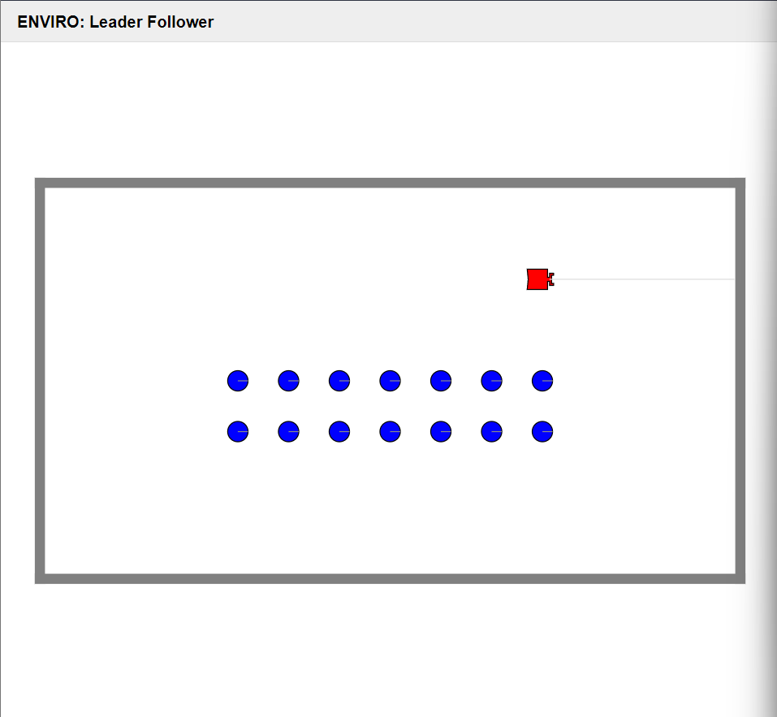

  ```
  Adithya Gowda Baragur
  gowdabar@uw.edu
  https://github.com/adithyagowda29/520-Assignments/Leader_Follower
  ```

# Leader-Follower Robots Simulation in Enviro Environment


## Goal of the project
The goal is to create a Leader robot and multiple Follower robots which are trying to follow the Leader at a respectable distance. The project uses Enviro v1.1 and Elma.

## Process

The Leader and Follower robots are placed in the arena. The Leader go around in a long rectangular loop in the arena. The followers one after another tries to follow the Leader robot each of them at a certain distance.
Below image is the snapshot at the beginning of the simulation. Red robot is the Leader robot and the blue ones are the Follower robots <br> <br>
 <br> <br>

Below video is the end result of the project where Follower Robots are following the Leader as a chain one after another.<br> <br>


I have tuned the weight and speed of all the Robots to give best possible physics of a real time scene.

## How to install and Run

1. Install docker
2. Clone the project repository onto the local PC. - ```git clone https://github.com/adithyagowda29/520-Assignments.git``` <br>
3. Run docker image ```docker run -p80:80 -p8765:8765 -v $PWD:/source -it klavins/enviro:v1.1 bash``` <br>
    As mentioned before, the project uses Enviro v1.1. This will start bash terminal in target container.
   * The `-p80:80 option maps port 80 from the Docker container to ports on your host computer.
   * The -p8765:8765 option allows the ENVIRO client to communicate with the enviro server (not yet running) via a WebSocket.
4. Navigate to the project folder.
5. Execute ```esm start```. This command uses the enviro setup manager to start a web server from which your browser can access the ENVRIO client.
6. Execute ```make``` to compile the project
7. Execute ```enviro``` to start the simulation
8. Navigate to  ```http://localhost``` in the browser to view the project simulation.

## Key challenges and How they were addressed

Below I have highlighted few of the key challenges I faced during the project and how I overcame them:

1. I had a challenge of getting the Leader to go in a loop. At first, I tried to have single class each for moving forward and rotating. But everything I tried, I was unable to get it working. So, I have created 4 classes each for moving forward and rotating one for each side and corner of the rectangular loop. <br> 

2. Next I had challenge with Follower robot, using the "move_toward" the bots took a lot of time to get to the desired distance and was unable to follow the robot. So I am using the "omni_move_toward" function, however the robot does not take orientation of the robot. The robots follow the Leader quickly since robot can directly start moving and no need to orientate itself before moving.<br>  

3. I started with Enviro v1.1 and since all the functions I used are supported in this version, I did not face any issue with the version. <br> 

4. Since the pre-defined methods in Enviro were not defined and explained in detail in the github repository, it was very time consuming to understand each of them. I did trial and error with different values to understand each methods and their respective arguments' behaviour. <br>

## License
This project is licensed under Apache 2.0

## References
1. https://github.com/klavinslab/enviro
2. https://github.com/sosper30/eep520/tree/main/week10